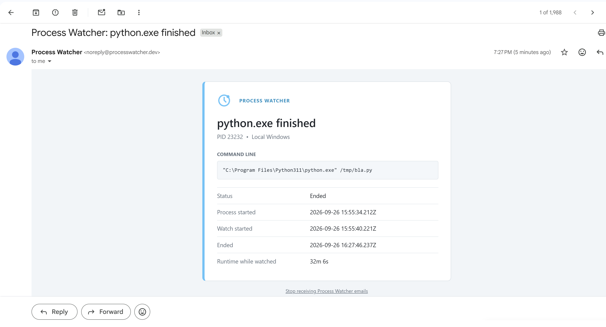

# Process Watcher - get a notification when any process completes

A tiny tool whose purpose is simple: let you know when any process has finished, in 2 clicks.

`**PLACEHOLDER_FOR_GIF**`

  
   
  <i>▶ Example: get a notification for a finished process</i>

---

> **TL;DR**  
> ✅ `Ctrl + Shift + P` → `Process Watcher: Add Process`  
> ✅ A notification will appear immediately when it completes, with an optional email notification as well.  
> ✅ That's it!  

---

## Sometimes, a notification is all you need

When a long process completes, instead of manually checking its progress constantly, 
a small Windows notification - and optionally an email - will keep you informed immediately.

Imagine running a process that you know takes 30 minutes. You do something else meanwhile,  
then come back and find out that the process completed after just 1 minute...  because of a stupid failure.  

If you were informed immediately, you could take action right away instead of discovering  
the failure much later. Well, as long as the notification is not annoying or spammy, and you
choose which process to follow.

Doing this for **any process** you choose on your machine - this is the pain that **Process Watcher** solves.

## Usage

You choose a process, any process - yours, someone else's, a Python script, a Copilot process, anything.

`**PLACEHOLDER_FOR_GIF**`

  
   
  <i>▶ Example: choosing a process to watch</i>

The process will be monitored by a simple tracker in the background that
will do the "manual checking" for you. You will be notified immediately once it completes by a small window notification that will remain there until you close it.

If you provide an email address, you will also receive an email notification once the process completes.

  
   
  <i>▶ Example: email notification for a finished process</i>

## Register your email

The motivation for email notifications is simple: if you are away from your computer (coffee break, let's say),  
you will still be informed immediately once it completes.

To receive email notifications, you need to register your email address.  
**No password or login is required**.  

Simply provide your email, verify it, and you will be notified when a
process you are watching completes.

Press `Ctrl + Shift + P` → `Process Watcher: Email Notifications`

A full example of registering your email for notifications:

`**PLACEHOLDER_FOR_GIF**`

  
   
  <i>▶ Example: registering your email for notifications</i>

## Manifest

* No annoying login.  
* No ads.  
* No tracking.  
* Completely free.  
* An open-source project.  

## Contributing / Issues 🤝

Found a bug? Need another feature? PRs are welcome.  
Please include:  

-   VS Code version  
-   OS (and remote/WSL if relevant)  
-   Steps to reproduce the issue  
-   Screenshots / GIFs if possible  

## License 📄

This project is licensed under the MIT License.  
See [LICENSE](LICENSE) for details.  